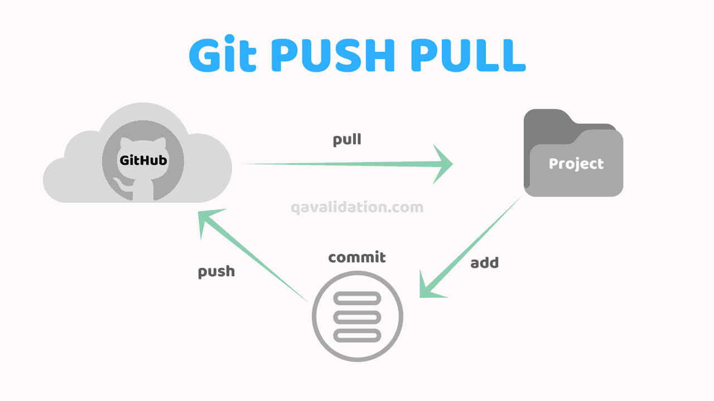

# *Tech201-git-github*
Basic practice of creating and editing a markdown file. 

## Creating the Markdown file

- Step 1: Open Git Bash 
- Step 2: `git mkdir` + name of the directory you wish to create
- Step 3: `cd` + name of the directory you have just created
- Step 4: `pwd` = shows current directory which you are navigating. 
- Step 5: `git clone` + https URL in GitHub of the repository you want to clone in your local environment
- Step 6: `ls` = listing files and directories
- Step 7: `cd` + name of the file or directory you want to navigate
- Step 8: `pwd` = to confirm which file or directory you are currently navigating
- Step 9: `nano` + README.md = make changed to the README.md file (documentation file)
- Step 10: add the changes that you want to make; once finished pres CTRL+X
- Step 11: confirm the changes you made by pressing Y 
- Step 12: `git add .` = add the changes made in your local environment
- Step 13: `git status` = to confirm that the changes have been added to your local environment
- Step 14: `git commit -m "concise message"` = commit the changes you have made
- Step 15: `git push -u origin main` = push the changes made in the local environment to the online environment
- Step 16: check the online environment for the changes you have just made.
- *These steps have been added from the local host.*
### Adding pictures to the Markdown file.

- Go into the local environment cloning the online one.
- Download the picture that you wish to add to the environment.
- Save the picture in the same folder as the README.md file. 
- Now, in Pycharm or Bash, you should be able to code the following:
- ``
- On the right hand side, in the Preview side, you should be able to see the picture.
- Now that we have the picture in the local environment, let`s push it in the online one.
- `git add .` = add the changes (in this cade the picture) to the Markdown file.
- `git status` = to make sure the changes have been sent. 
- `git commit -m "concise message"` = commit the change.
- `git push -u origin main` = push the change on the online environment.
- Go on GitHub and check that the picture has been successfully added. 
- Weehey! You have successfully added a picture to your Markdown file! 

